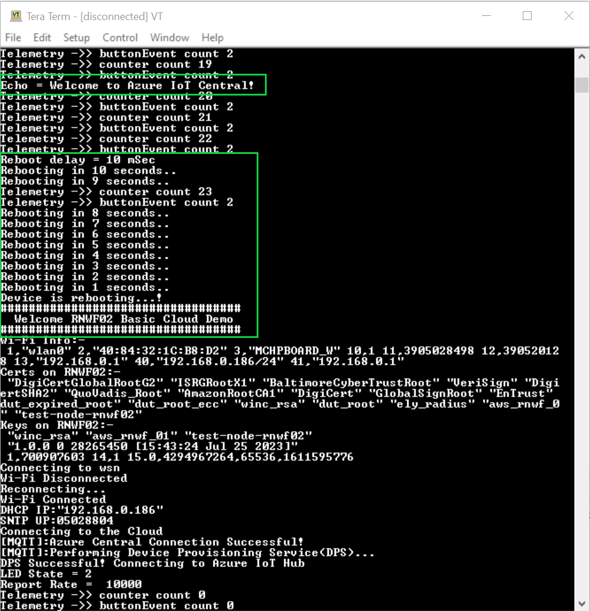

# Azure Cloud Demo

This application demonstrates MQTT/Telemetry in which the Microchip RNWF02 board acts as a MQTT client. The RNWF02 module ships with a built-in X.509 certificate which simplifies the TLS handshake protocol with Microsoft Azure. Setting it up requires programming a few registers using AT+ commands and uploading two self-signed certificates to the device plus one to Azure. Using this application, most users can connect their Microchip RNWF02 to Azure Cloud/Azure IoT Hub in a few minutes.
Note: User is required to configure the Wi-Fi credentials for Home-AP.

## Introduction

The demo requires a few basic steps, which includes signing up for a Microsoft Azure account.

 - Software Installation: This demo requires Windows 10 or later, a recent version of Git for Windows, Python 3.10.x or later. A serial Terminal is optional but highly recommended.

 - Create Self-Signed Certificates: Use the included 'bash' scripts to create the 3 certificates required.

 - Microsoft Azure: Create a new "free" or "pay" account or use an existing account.

## Prerequisites

### Hardware
 - Microchip RNWF02 module
 - Available Wi-Fi router, SSID, Password and Security setting
 - USB Type-A male to USB-C USB cable or USB-C to USB-C (PC dependent)

### Software
 - Windows 10 or later
 - [Git](https://git-scm.com/downloads) for Windows x64, v2.40 or later.
    - Includes "OpenSSL" needed to create "self-signed" certificates
    - Select all installation defaults including "Shell Integration" for Bash terminal
 - [Python](https://www.python.org/downloads/) v3.10.11 or later
 - Various Scripts (included in the "\Tools" folder)

    - CertificateTool - Bash scripts used to generate self-signed certificate chains
    - COMPorts - Python/Cmd script used to display attached USB UARTs
        - sentTo_tool - Python/Cmd script allowing user to "right-click" flash device certificates directly to the RNFW02 module.
 - Serial Terminal - Used for UART testing & manually sending "AT+" commands

    - Capable of UART communication at 230400b [8N1].
    - Must send "\r\n" on ENTER key.
        - [Lorris Toolbox](https://tasssadar.github.io/Lorris/), v9.44 or later
            - 'Enter' behavior: Menu->Terminal->Change Settings:
            - Pressing return/enter key sends: "\r\n(DOS)"
        - Tera Term v4.x or later: https://ttssh2.osdn.jp/index.html.en
            - 'Enter' behavior: Menu->Setup-Terminal...
            - New-line, Receive: "CR", Transmit: "CR+LF"
 - Text editor - Used to manually edit the "app.cfg" file if needed
    - Any text editor should work as long as it supports the UTF8 character set
        - NotePad, NotePad++, Visual Studio Code, etc.

### Software Setup

Doc. Note: Please add content from section *"Software Setup"* [here](https://bitbucket.microchip.com/users/c75117/repos/oobdemo/browse/readme.md?at=refs%2Fheads%2FRC1)

### Create a Microsoft Azure Account

Doc. Note: Please add content from section *"Create a Microsoft Azure Account"* [here](https://bitbucket.microchip.com/users/c75117/repos/oobdemo/browse/readme.md?at=refs%2Fheads%2FRC1)

### Demo Setup

Setting up the demo consists of creating 3 steps.

1. Creating & Installing self-signed certificates for encrypted, secure communication with Azure.
2. Creating and configuring an Azure app in the cloud.
3. Configuring and running the demo and test cloud to RNWF02 bi-directional MQTT/Telemetry communication.

#### Creating & Installing self-signed certificates for encrypted, secure communication with Azure:

Doc. Note: Please add content from section *"Certificate Infrastructure"* [here](https://github.com/htenkod/wireless_apps_rnwf02/tree/doc/apps/basic_cloud_demo#certificate-infrastructure)

Doc. Note: Please add content from section *"Installing Certificates to the RNWF02 module"* [here](https://bitbucket.microchip.com/users/c75117/repos/oobdemo/browse/readme.md?at=refs%2Fheads%2FRC1)

#### Creating and configuring an Azure app in the cloud

Doc. Note: Please add content from section *"Building An App"* [here](https://bitbucket.microchip.com/users/c75117/repos/oobdemo/browse/readme.md?at=refs%2Fheads%2FRC1)
excluding "App.cfg Setting" sub-bullet under "Setting the Device connection groups" sub-section.

#### Configuring and running the demo and test cloud to RNWF02 bi-directional MQTT/Telemetry communication

Doc. Note: Please add content from section *"6.5.1 Building the Application"* from TR4 draft - RNWF02 Application Developer's Guide

Doc. Note: Please add content from section *"6.5.2 Running the Application"* from TR4 draft - RNWF02 Application Developer's Guide. Add bullet points No. 1, 2, 3, skip to 5, 6, 7, 8 (Remove bullet point 4)
Add points 9 and 10 as below with the images from [here](https://github.com/htenkod/wireless_apps_rnwf02/tree/doc/assets)

9. As the board boots up, application will list available certificates and keys on RNWF02 board. The board will connect to Home-AP configured. After this, the demo will attempt to connect to Azure IoT Hub (using link configured) and start performing telemetry. User can modify device properties from Azure Cloud with the help of configured Azure IoT central app as shown below

10. Change Device Parameters/ How to manipulate: Cloud to Device(C2D) Parameters

Doc. Note: Please add content from section *"Cloud to Device(C2D) Parameters"* [here](https://bitbucket.microchip.com/users/c75117/repos/oobdemo/browse/readme.md?at=refs%2Fheads%2FRC1)