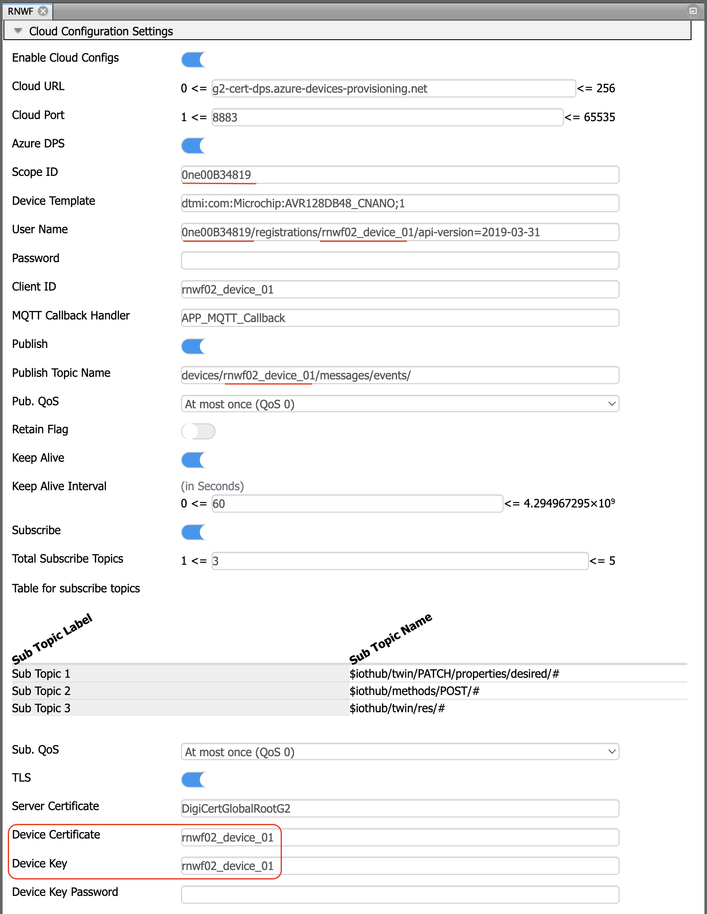

Azure Cloud Demo

The Azure Cloud Application demonstrates the Azure Plug and Play connection with the Azure IoT Central. The RNWF02 board acts as a MQTT client using the inbuilt MQTT AT Command sets. The demo uses the x.509 certificate based group enrollment to ease the connection of multiple devices to the Azure cloud.

The RNWF02 module ships with a built-in X.509 root certificates to authenticate Azure MQTT server which simplifies the TLS handshake protocol with Microsoft Azure.

The user can upload the device certificates into the RNWF02 for the TLS client authentication. Using this application, most users can connect their Microchip RNWF02 to Azure Cloud/Azure IoT Hub in a few minutes.

## Running the Application

1. Create a Root of Trust Chain for RNWF Devices

	The demo applicaiton includes a set of tools in "../apps/azure_cloud/tools" folder. It enables easy creation of certificate infrastructure and individual device certificates with very minimal user inputs.

>| :exclamation:    Note| 
>|-----------------------------------------|
>|On Windows Operating Systems, make sure the [GitBash](https://git-scm.com/download/win) is installed to run these tools. |
>|These scripts are based on the Azure's Create and Upload Certificates for Testing tutorial.|

1. 1.  Right click and open the GitBash in the tools folder

1. 2. Run the create_initial_setup.sh as shown in the following screenshot. It will request the user to provide the domain suffix and common name for Root CA.

1. 3. Up on successful execution of above command, following 3 new folders will be created!

Device Certificate

1. 4. Run the create_device_certificate.sh to create individual device certificate. It requests the user to provide Subordinate/Intermediate CA folder name and a unique device id (Common Name). Make a note :memo: of device ID or common name to later use in Azure configuration.

>| :exclamation:    In order to modify the default subject identifier information, open the create_device_certificate.sh and update the following macros.| 
>|-----------------------------------------|
>|

|

1. 5. On successful execution of device certificate, a new folder is created inside the ../tools/devcerts folder as shown in following screenshot. Note :memo:  down the certificate and key file names(by default device ID or common name) to use later in the Azure TLS configuration

1. 6. Use the PC companion mode of the setup and program the <device id>.pem and * <device id>.key* files (highlighted/marked below) using file_upload tools.

2. Create a Microsoft Azure Account and Azure IoT Central Application

2. 1 Create a new [Azure Account](https://azure.microsoft.com/en-us/free) if you don't already have one.

2. 2 Log into the [Azure Portal](https://azure.microsoft.com/en-us/free) using the new/existing account

2. 3 Create an IoT Central Applicaiton at Create a resource -> Internet of Things

2. 4 Under Subscription create a new group (say RNWF) to manage it's resources and cost

2. 5 Provide the resource name and Application URL to view/manage the IoT Central devices

2. 6 Open the [Azure Central Applicaiton](https://apps.azureiotcentral.com/build) and build a new App

# 

2. 7 Select the application and navigate to 'Permision->Device connection groups'

2. 8 Node down the ID scope :memo:  and click '+ New' to create a enrollment group

2. 9 Provide a name for the enrollment group and select Attestation Type as 'Certificates (X.509)'

2. 10 Save the enrollment group and Manage the Primary certificate and select the subordinate CA certificated generated in the step 1. 3 subca.crt certificate inside the subca folder.

3. Mount 'AVR128DB48 Curiosity Nano' and 'RNWF02 Add On Board' boards on 'Curiosity Nano base for click' board at respective headers. For more details about the boards placement in the Curiosity Nano base, see Figure 6-1.

4. Connect the debugger USB port on the AVR128DB48 Curiosity Nano board to computer using a micro USB cable

5. Open the project and launch MCC with Melody Content Manager Tool

6. Configure Home-AP credentials for STA Mode

7. Update the Azure Cloud configuration with following details 
	- ID Scope noted in the above 2.1 step
	- Unique Device ID (Common Name) noted in the above 1.4 step
	- Device Certificate and Key file Names noted in the above 1.6 step

9. Regenerate, build and program the code to the hardware using MPLABX, as the board boots up the application will list available certificates and keys on RNWF02 board. The board will connect to Home-AP configured. After this, the demo will attempt to connect to Azure IoT Hub (using link configured) and starts sending the telemetry. 

8. After the successful connection to Azure IoT Central, the device gets listed in the [Azure Central Applicaiton](https://apps.azureiotcentral.com) -> Devices view.

9. Click on the device name to view the device About, Overview, Commands, Raw data tabs as follows

10. The Overview tab shows the default Telemetry graph, the Overview view can me modified by adding other parameters through the "Device Templates->(Model)->Views->Overview"

11. New views can be added through the "Device Templates->(Model)->Views" 

12. Example add a 'Properties' View tab and all all the properties, now through the 'Properties' view one can change the LED status on the board and Telemtery Reporting Rate. Make sure to 'Save' the new values.

13. The Commands view can be used to trigger a device reset at a given time in the ISO format(Example PT5S for 5 seconds) or to send messages(echoed from device) to the device.

14. The SW0 press from the device will be notified to the Azure Cloud in the Raw data view.

