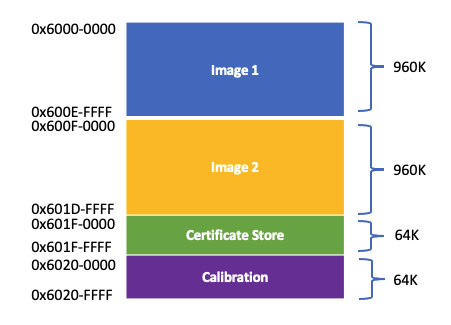
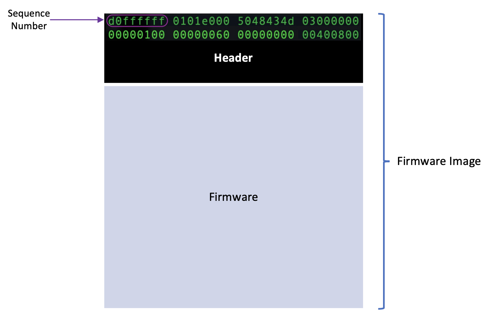
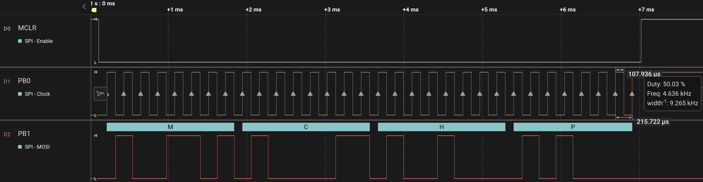

## Device Firmware Update (DFU)

The RNWF02 modules are secured parts and all traditional programming interfaces are disabled. These modules can only execute the firmwares which are signed by Microchip's signer. 

As all the programming interfaces are disabled, the RNWF02 module's enable a special mode called DFU mode to perform the Firmware update. 

The RNWF02 module provides fail safe device firmware upgrade by having 2 image slots in the flash map. The RNWF02 modules shipped from Microchip uses the Image2 partition to store the default firmware. The Image1 partition can be used for upgrading to new firmware image.

      

These firmware images are appended with a 512 bytes header, the first 4 bytes of the header keeps the firmware sequence number. 

The device always chooses the lowest sequence number image among the 2 partitions to boot on every power up.

      

It is recommended to use the low partition for the OTA(over the air) firmware upgrade. The device can switch back to the default firmware in the high partition by erasing the low partition of the flash map. 

In order to place the device in DFU mode a unique pattern('MCHP') needs to be triggered on the following pins:-

| RNWF02 Module      |  Description                   |
|--------------------|------------------------------- |
|MCLR_N (Pin#4)      | Master clear reset, active-low |
|PB0/DFU_Rx (Pin#26) | DFU pattern clock / UART Rx    |
|PB1/DFU_Tx (Pin#10) | DFU pattern data / UART Tx     |

Following is the screenshot of the DFU mode pattern. 

      

Sample DFU pattern generation code is as follows:- 
~~~
void DFU_PE_InjectTestPattern(void)
{
    /* Programming Executive (PE) test pattern 'MCHP' PGC->Tx PGC->Rx*/
    const char *PE_TP_MCLR = "100000000000000000000000000000000000000000000000000000000000000001";
    const char *PE_TP_PGC  = "001010101010101010101010101010101010101010101010101010101010101011";
    const char *PE_TP_PGD  = "000110000111100110011000000001111001100001100000000110011000000000";

#ifdef DFU_DEBUG
    DBG_MSG_OTA("* Sending test pattern *\r\n%s\r\n%s\r\n%s\r\n", PE_TP_MCLR, PE_TP_PGC, PE_TP_PGD);
#endif
    /* Deinitialize the UART*/
    UART2.Deinitialize();

    /* Configure the DFU lines as output*/
    MCLR_N_SetDigitalOutput();
    DFU_RX_SetDigitalOutput();
    DFU_TX_SetDigitalOutput();

    DELAY_milliseconds(MSEC_TO_SEC);

    for (volatile int i=0; i<(int)strlen(PE_TP_MCLR); i++)
    {
        /* MCLR */
        if((PE_TP_MCLR[i] - '0'))
            MCLR_N_SetHigh();
        else
            MCLR_N_SetLow();
        /* PGC */
        if((PE_TP_PGC[i] - '0'))
            DFU_RX_SetHigh();
        else
            DFU_RX_SetLow();

        /* PGD */
        if((PE_TP_PGD[i] - '0'))
            DFU_TX_SetHigh();
        else
            DFU_TX_SetLow();

        DELAY_microseconds(TP_DELAY_USEC);
    }

    /* It's a Rx pin for Host */
    DFU_TX_SetDigitalInput();
    /* To avoid driving MCLR_N */
    MCLR_N_SetDigitalInput();
    /* Configure back as UART to send FW Image */
    UART2.Initialize();
}
~~~

On successful entry of DFU mode, the PB0/DFU_Rx (Pin#26) and PB1/DFU_Tx (Pin#10) pins are reconfigured as UART lines with the ***230400 8 NONE 1*** configuration. 

In DFU mode, the RNWF02 module runs a program executive(PE) firmware which can support following operations. 
- PE Version read
<!---	
	The PE Version read command frame is as following:- 

	|READ   | byte 0 | CMD   | byte 2|
	|-------|--------|-------|-------|
	| 0x01  | 0x00   | 0x07  | 0x01  |

	The response to the command would be 4 bytes in the following format:-

	|PE Version | byte 1 | CMD   | byte 3    |
	|-----------|--------|-------|-----------|
	| 0x01      | 0x00   | 0x07  | 0x00      |
--->
- Device ID Read
<!---
	The Device ID read command frame is as following:- 

	|READ   | byte0 | byte 1| byte 2|
	|-------|-------|-------|-------|
	| 0x01  | 0x00  | 0x00  | 0x01  |

	The response to the command would be 8 bytes in the following format:-

	| byte 0| byte 1 | CMD   | byte 3   | ID Byte 0 | ID Byte 0 | ID Byte 0 | ID Byte 0 |
	|-------|--------|-------|----------|-----------|-----------|-----------|-----------|
	| 0x00  | 0x00   | 0x0A  | 0x00     | 0x53      | 0x00      |   0xC7    |  0x29     |  
--->
- Flash Erase

- Flash Write

These PE operations are triggered using a 4 bytes command frame and response length depends on the requested operation. 

The successful entry of the DFU mode is verified by reading the PE version and Device ID.
Following snippet of code can read the PE version(0x01) and Device ID(0x29C7x053).

~~~
uint8_t DFU_PE_Version(void)
{
    uint32_t data = 0;
    uint8_t  peVersion = 0;
    uint8_t  byteResp[4];

    data = PE_CMD_EXEC_VERSION;
    data = (data << 16) | 0x1;

#ifdef DFU_DEBUG
    DBG_MSG_OTA("Sending PE version request\r\n");
#endif

    /* Send the PE Version read Command */
    RNWF_IF_Write((uint8_t *)&data, 4);

    /* Response */
    if(RNWF_IF_Read(byteResp, 4) == 4)
    {
        peVersion = byteResp[0];
        DBG_MSG_OTA("PE version: %d\r\n\r\n", (unsigned int)peVersion);
        return peVersion;
    }
    return 0;
}

uint32_t DFU_PE_Chip_ID(void)
{
    uint32_t data = 0;    
    uint32_t  byteResp[2];

    data = PE_CMD_GET_DEVICE_ID;
    data = (data << 16) | 0x01;

#ifdef DFU_DEBUG
    DBG_MSG_OTA("Sending PE chip ID request\r\n");
#endif

    /* Send the CHIP ID read Command */
    RNWF_IF_Write((uint8_t *)&data, 4);

    /* Response */
    RNWF_IF_Read((uint8_t *)byteResp, 8);

#ifdef DFU_DEBUG
    DBG_MSG_OTA("Chip ID: %lX\r\n", (uint32_t)byteResp[1]);
#endif
    return byteResp[1];
}

~~~

Once the device is in DFU mode, the device's secured flash can be erased and Firmware binary can can be written over the UART interface.

The Erase operation takes the starting address (0x6000-0000 or 0x600F-0000) and the number of pages of 4096 bytes. 

~~~
bool DFU_PE_Erase(const uint32_t address, const uint32_t length)
{
    uint32_t data = 0;
    uint32_t pages = length / (uint32_t)PE_ERASE_PAGE_SIZE;
    uint8_t  byteResp[4];

    if (length % (uint32_t)PE_ERASE_PAGE_SIZE > (uint32_t)0)
    {
        pages += (uint32_t)1;
    }

#ifdef DFU_DEBUG    
    DBG_MSG_OTA("PE erase pages = %d\r\n", pages);
#endif
    
    data = PE_CMD_PAGE_ERASE;
    data = data << 16;
    data |= (pages &= 0x0000ffff);

#ifdef DFU_DEBUG
    DBG_MSG_OTA("Sending PE erase\r\n");    
#endif

    /* Send the Erase Command */
    RNWF_IF_Write((uint8_t *)&data, 4);
    DELAY_microseconds(WRITE_DELAY_USEC);

    /* Send the address */    
    RNWF_IF_Write((uint8_t *)&address, 4);
    DELAY_microseconds(WRITE_DELAY_USEC);

    /* Wait for the Erase complete */
    DELAY_milliseconds(4000);
    /* Response */
    RNWF_IF_Read(byteResp, 4);
        
    if (((char)byteResp[2] != (char)PE_CMD_PAGE_ERASE) || ((char)byteResp[0] != (char)0) || ((char)byteResp[1] != (char)0))
    {
        DBG_MSG_OTA("Error: PE erase failed\r\n");
        return false;
    }

    DBG_MSG_OTA("\r\nErase done!\r\n");
    return true;
}
~~~

The DFU write operation takes the address and firmware binary and the length of integer factors of 4096 bytes but not exceeding it.

Following is the reference code for implmenting the DFU write operation.

~~~

bool DFU_PE_Write(uint32_t address, const uint32_t length, uint8_t *PE_writeBuffer)
{
    /* The address must be 32-bit aligned, and the number of bytes (length) must be a
    multiple of a 32-bit word. */
    uint32_t data = 0;
    uint32_t checksumValue = 0;
    uint8_t byteResp[4];

    if (length>(uint16_t)MAX_PE_WRITE_SIZE)
    {
        DBG_MSG_OTA("ERROR: Length exceeds MAX_PE_WRITE_SIZE\r\n");
        return false;
    }

    /* Length should be integer factor of 4096 and divisible by 4 */
    if ((((uint16_t)MAX_PE_WRITE_SIZE % length) != (uint16_t)0) || ((length % (uint16_t)4) != (uint16_t)0))
    {
        DBG_MSG_OTA("ERROR: Length should be integer factor of 4096 and divisible by 4\r\n");
        return false;
    }

    /* Assemble PE write command */
    data |= ((uint32_t)0x0000ffff & (uint32_t)PE_CMD_PGM_CLUSTER_VERIFY);
    data = data << 16;
    data |= (CFGMethod & 0x0000ffff);

    /* Send the Write Command */    
    RNWF_IF_Write((uint8_t *)&data, sizeof(uint32_t));
    DELAY_microseconds(WRITE_DELAY_USEC);

    /* Send the address */    
    RNWF_IF_Write((uint8_t *)&address, sizeof(uint32_t));
    DELAY_microseconds(WRITE_DELAY_USEC);

    /* Send the write buffer length */    
    RNWF_IF_Write((uint8_t *)&length, sizeof(uint32_t));
    DELAY_microseconds(WRITE_DELAY_USEC);

    /* Calculate the Checksum */
    for (uint16_t i=0; i<length; i++)
    {
        checksumValue += PE_writeBuffer[i];
    }

    /* Write the checksum */    
    RNWF_IF_Write((uint8_t *)&checksumValue, sizeof(uint32_t));
    DELAY_microseconds(WRITE_DELAY_USEC);

    /* Write the write buffer contents */    
    RNWF_IF_Write((uint8_t *)PE_writeBuffer, length);
    DELAY_microseconds(60);
        
    /* Response */
    RNWF_IF_Read(byteResp, 4);

    /* Verify response for errors */
    if (((char)byteResp[2] != (char)PE_CMD_PGM_CLUSTER_VERIFY) || ((char)byteResp[0] != (char)0) || ((char)byteResp[1] != (char)0))
    {
        DBG_MSG_OTA("Error: PE write failed[%02X %02X %02X %02X]\r\n", byteResp[0], byteResp[1], byteResp[2], byteResp[3]);
        return false;
    }

    return true;
}

~~~

Note:- The OTA service layer implements these functionality to ease the development of Host Assisted OTA. 

We also support a PC based python tool to perform the DFU on RNWF02 modules. Please refer the Tools->Device Programming section for more details.

**_NOTE:-_** 

- For the Host assisted DFU, the Host side pins should be able to drive the pattern and also reconfigure the same pins as UART lines using the pin multiplexing options. We recommend to use Microchip's Microcontrollers as host which can support this feature by default

- The RNWF02 AddOn Board has the interconnected UART1_Tx to PB1/DFU_Tx and UART1_Rx with PB0_Rx to enable both Mission Mode and DFU operation over the single UART interface.
