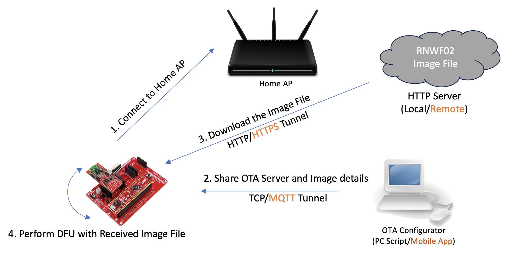
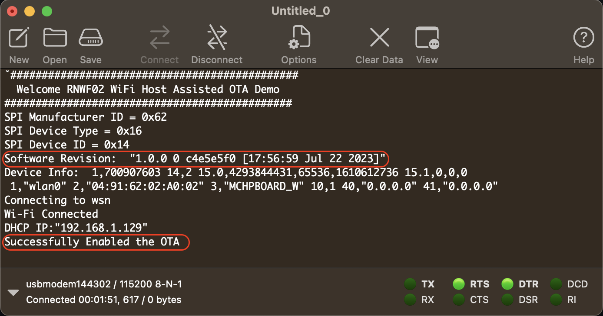
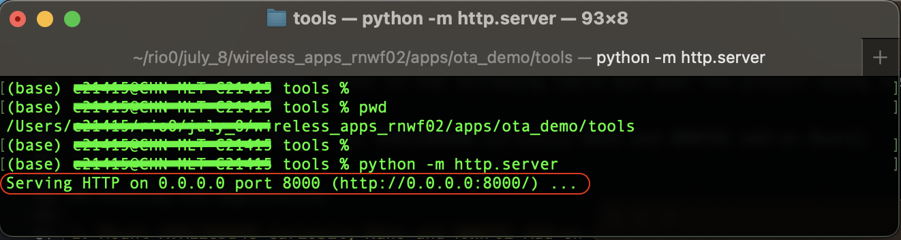
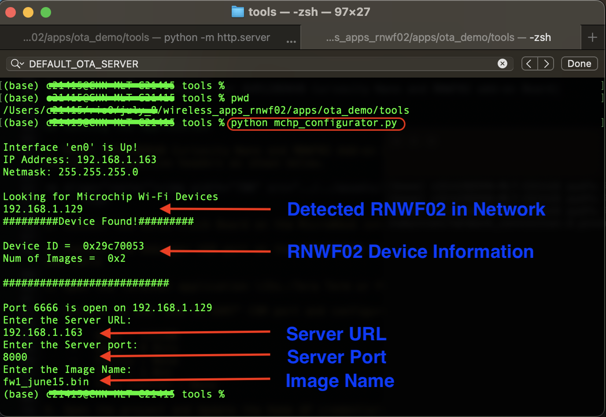
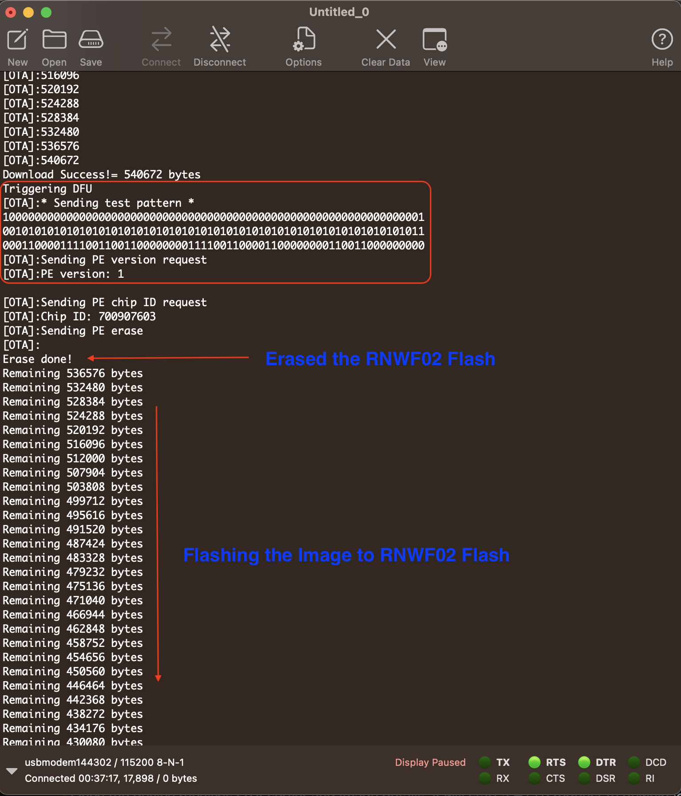
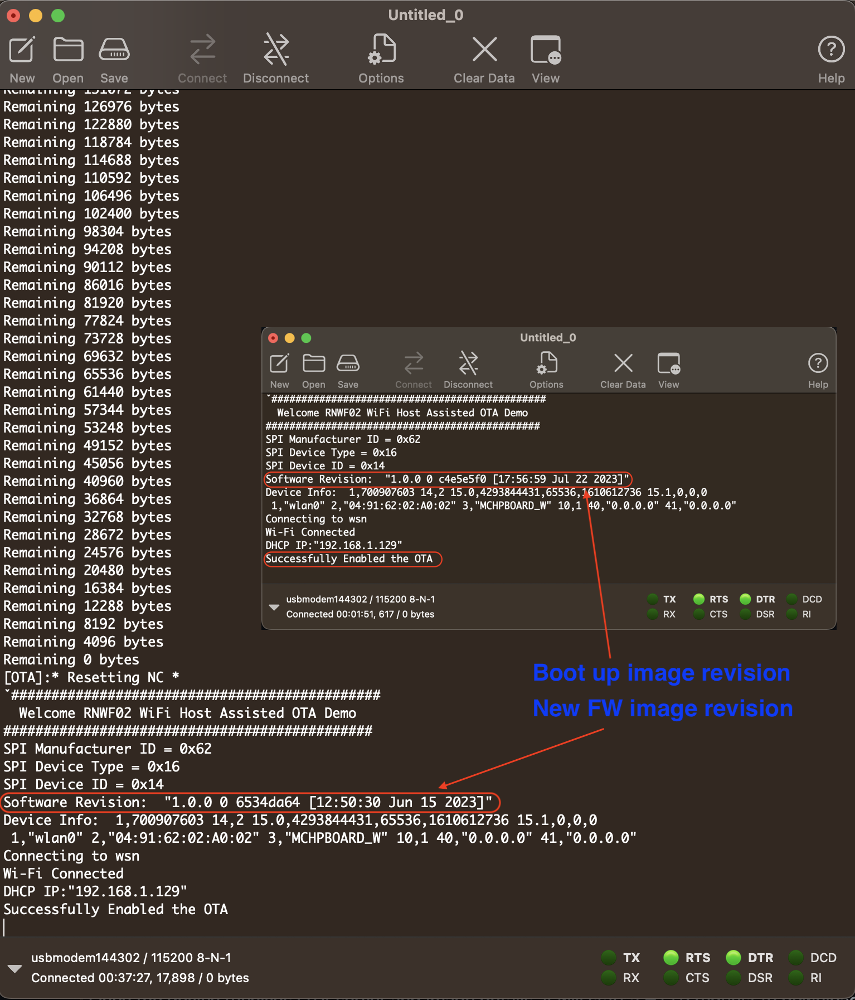

# Host Assisted Over the Air Device Firmware Update(DFU) Demo

This RNWF02 application illustrates the RNWF02 module Firmware update via HTTP/HTTPS protocol.

## Description

The Host Assisted Over the Air Device Firmware Update application demonstrates the RNWF02 
Firmware Upgrade mechanism. 

The Demo examples requires following 2 entities to demonstarte the RNWF02 Firmware Ugprade

- HTTP Server 			<- Hosts the firmware image file 
- OTA Configurator		<- Configures and initiats the firmware upgrade 

#### HTTP Server
The HTTP Server is hosted using the Following python command 

#### OTA Configurator
The OTA Configurator is a simple python tool which detects the RNWF02 devices in the subnet and shares the HTTP Server details along with the Firmware Image file.

Following is the demo setup block diagram

      

Note Text in Orrange are the alternative options but not part of the current demo 

On the boot up the device will connect to the configured Home AP and resolves the DHCP IP address. After the successful DHCP resolution it opens up a TCP tunnel to receive the OTA server and Image details. 
The user needs to run the OTA configurator from another machine(PC/Mobile) connected to the same network. The OTA configurator tool requests the user to input the server URL, port number and Image(binary file) name.

Once the device receives OTA server and Image details, it will start a HTTP request to download the Image file. 

The received image file is stored in the SST25 SPI flash connected to the MikroBUS 1 interface. After complete image is downloaded, the Device Firmware Update(DFU) is triggered. The RNWF02 module will enter a special mode and gets ready to receive the firmware file. The new firmware 

## Downloading and building the application

To download or clone this application from Github, go to the [top level of the repository](../../../../)

Path of the application within the repository is **apps/wifi_easy_config/rnwf02_wifi_easy_config.X/** . 

To build the application, refer to the following table and open the project using its IDE.
|Project Name|Description|
|------------|-----------|
|ota_demo.X|MPLABX project for AVR128DB48 Curiosity Nano and RNWF02 add-on Board|
| | |

## Running the Application

1. Mount AVR128DB48 Curiosity Nano and RNWF02 Add-on Boards over Curiosity Nano base for click boards at respective headers as shown below.

      

2. Connect the SST25 Click Board on the MicroBUuS interface 1

3. Connect the debugger USB port on the AVR128DB48 Curiosity Nano board to computer using a micro USB cable

4. Open the Terminal application \(Ex.:Tera Term or PuTTY\) on the computer

5. Connect to the "USB to UART" COM port and configure the serial settings as follows:

    -   Baud : 115200
    -   Data : 8 Bits
    -   Parity : None
    -   Stop : 1 Bit
    -   Flow Control : None

6. Open the project and Update the Home AP credentials found at [main.c](../ota_demo/rnwf02_ota_demo.X/main.c#L47)

7. Build and program the code into the AVR128DB48 target using IDE

8. The board will boot-up and connect to Home AP, as per the configurations given in step 6. 

9. After the successfull Wi-Fi connection the device opens up a TCP tunnel and wait for the OTA server and firmware image details from the configurator tool

      

10. The example inlcudes 3 sample firmware binaries in the ../ota_demo/tools folder, start a python HTTP server using the following command. (Make sure to note down the server IP address)

      

11. Run the python OTA configurator tool from the ../ota_demo/tools folder, as shown in the following screenshot

      

12. Now the deivce creates a HTTP link with the OTA server and starts downloading the image file.

      

13. After the successful download of the image, the DFU is triggered and firmware is flashed into the RNWF02 module

      

14. Upon successful DFU, the host will reset and prints the RNWF02 modules new FW information 

      

